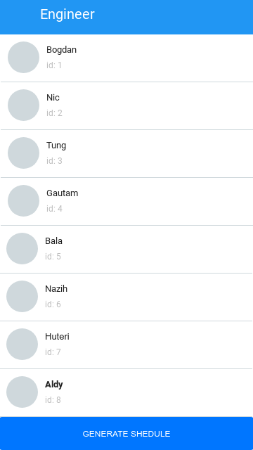
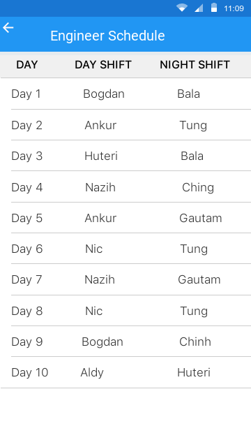

# Support Wheel of Fate 
An online “Support Wheel of Fate”. This should repeat selecting two engineers at random to both complete a half day of support (shift) each to ultimately generate a schedule that shows whose turn is it to support the business.

## What is it?
All engineers in Company X take it in turns to support the business for half a day at a time. 
Currently, generating a schedule that shows who’s turn is it to support the business is being done manually and we need to automate that!

#### The rules
- [x] There are only two support shifts per day, <b>a day shift </b> and <b>a night shift </b>.
- [x] An engineer can do at most one shift in a day.
- [x] An engineer cannot have more than one shift on any consecutive days.
- [x] Each engineer should have completed 2 shifts of support in any 2 week period.

#### The app
The app has UI to show the fetched list of engineers and the schedule generated by the developed algorithm. 
UX/UI is up to you to decide; however, two following screens should be included:


#### The Front End Design 

- <b>Engineers list screen</b>: A screen showing the fetched list of engineers with a "Generate Schedule" button somewhere in the UI. Clicking on the "Generate Schedule" button should navigate to the schedule screen.
 						
- <b>Schedule screen</b>: A screen showing the generated schedule. The user should be able to navigate back to the engineers list screen by clicking on the back button

 

 
#### Technology Stack 
 
| Frontend      | Backend       | Database   |
| ------------- |:-------------:| ----------:|
| Kotlin        | Express       | MySql      |
|               | Node          |            |

#### Framework Design 


## Installation
Clone this repository and import into **Android Studio**
```bash
git clone https://github.com/iasmar/Android-Support-Wheel-of-Fate.git
```
## Build variants
Use the Android Studio *Build Variants* button to choose between **prod** and **qualityAssurance** and **mock** flavors combined with debug and release build types


## Building using Android Studio...

1. Open Android Studio and launch the Android SDK manager from it (Tools | Android | SDK Manager)
1. Select *Open an existing Android Studio project*
1. Select the **Android-Support-Wheel-of-Fate** directory.
1. Select the **Build variant** (mockDebug, mockQualityAssurance, prodDebug, prodQualityAssurance, prodRelease).

## Building
To build the samples after you have applied the changes above, you can use the build/run option in Android Studio, or build directly from the command line if you prefer.

 ## Built With

* [Gradle](https://guides.gradle.org/building-android-apps/)


 						

 						

 						

